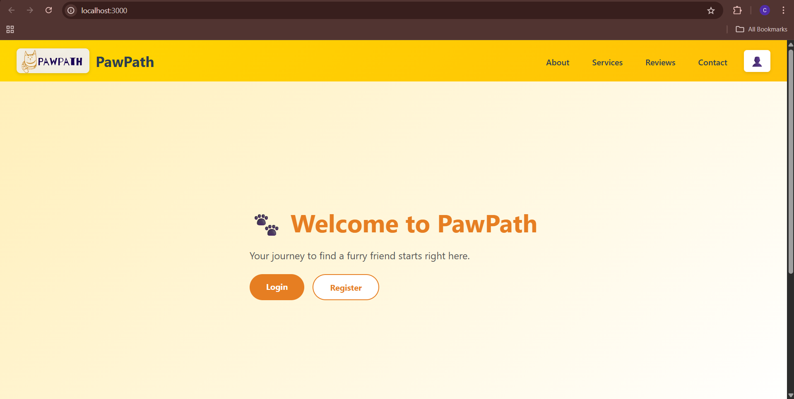
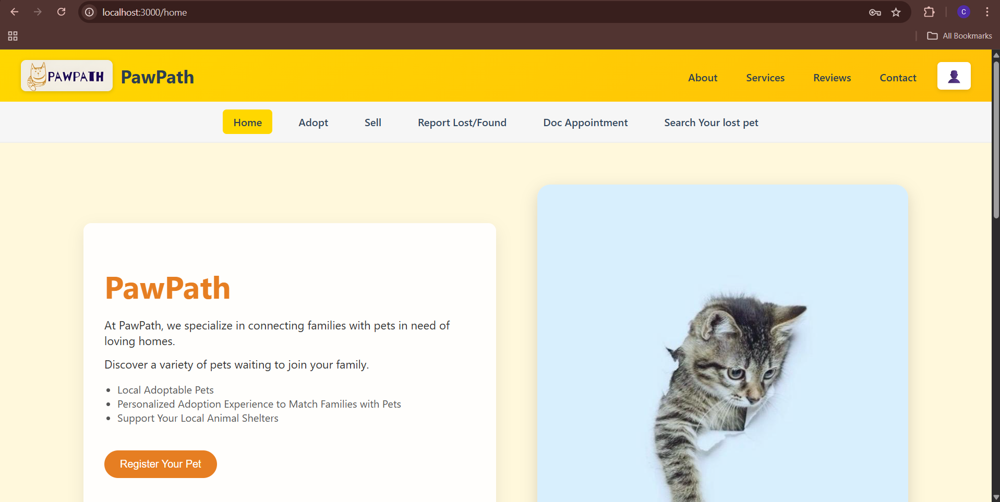
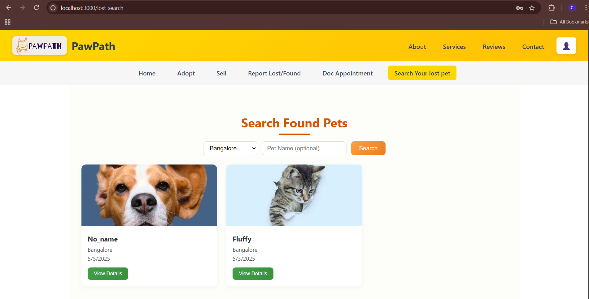
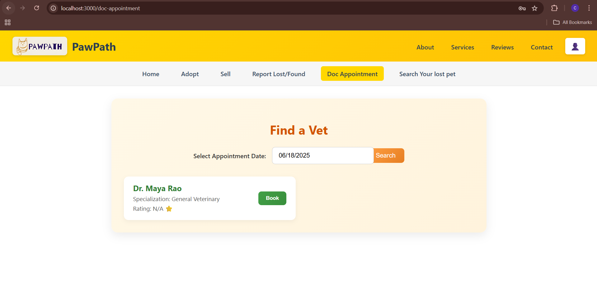
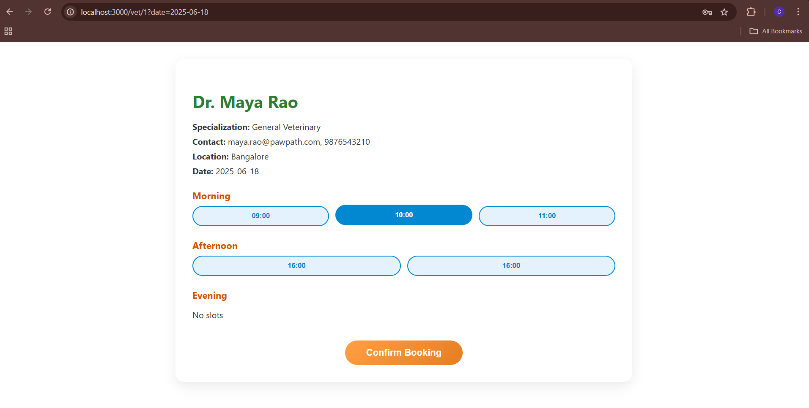

# 🐾 PawPath

**PawPath** is a full-stack community-driven web application built for pet lovers, shelters, and rescuers. It enables users to adopt pets, report lost & found animals, book vet appointments, and engage in community reviews and discussions. The goal is to provide a centralized hub for animal welfare services and connect people with trustworthy local resources.

---

## 🚀 Features

- 🔐 Secure User Authentication
- 🐶 Pet Listings for Adoption (Add, View, Search)
- 📍 Lost & Found Pet Reporting with Location Search
- 🏥 Vet Clinic and Doctor Appointment Booking
- 🧑‍⚕️ Verified Vet and Shelter Listings
- 💬 Review & Feedback System
- 📩 In-App Messaging and Profile Management
- 📥 RESTful Backend API using Express.js
- ⚛️ Responsive UI with React

---

## 🛠️ Tech Stack


### Frontend:
- React
- React Router
- Axios
- Context API (Auth & Global State)

### Backend:
- Node.js
- Express.js
- JWT Authentication
- Bcrypt Password Hashing
- CORS, Helmet

### Database:
- PostgreSQL
- Structured schemas with relationships
- Tables: Users, Pets, Reports, Reviews, Vets, Appointments, Messages

---

## 🧰 Getting Started

### 🔹 Clone the Repository

```bash
git clone https://github.com/Chinmaym6/PawPath.git
cd PawPath
```

### 🔹 Set Up the Backend

```bash
cd server
npm install
```

Create a .env file in the backend directory:

```bash
PORT=5000
JWT_SECRET=your_jwt_secret
DB_HOST=localhost
DB_PORT=5432
DB_USER=postgres
DB_PASSWORD=your_password
DB_NAME=pawpath
```

### Database Code is at the end
Open PostgreSQL and create a database and run those scripts

Start the backend server:
```bash
node index.js
```

### 🔹 Set Up the Frontend
```bash
cd client
npm install
npm start
```

###🔹 Visit the App

Open your browser and go to:
```bash
http://localhost:3000
```

### 📊 Landing


### 📊 Home


### 📊 Adopt Pet


### 📊 Search lost pet


### 📊 Vet Appointment


### 📊 Book Vet


### 📊 My Profile 


### 📊 Reviews


##DataBase

-- Table: public.adoptions

-- DROP TABLE IF EXISTS public.adoptions;

CREATE TABLE IF NOT EXISTS public.adoptions
(
    id integer NOT NULL DEFAULT nextval('adoptions_id_seq'::regclass),
    user_id integer,
    pet_id integer,
    adopted_at timestamp without time zone DEFAULT CURRENT_TIMESTAMP,
    CONSTRAINT adoptions_pkey PRIMARY KEY (id),
    CONSTRAINT adoptions_pet_id_fkey FOREIGN KEY (pet_id)
        REFERENCES public.pets (id) MATCH SIMPLE
        ON UPDATE NO ACTION
        ON DELETE SET NULL,
    CONSTRAINT adoptions_user_id_fkey FOREIGN KEY (user_id)
        REFERENCES public.users (id) MATCH SIMPLE
        ON UPDATE NO ACTION
        ON DELETE CASCADE
)

TABLESPACE pg_default;

ALTER TABLE IF EXISTS public.adoptions
    OWNER to postgres;

-- Table: public.appointments

-- DROP TABLE IF EXISTS public.appointments;

CREATE TABLE IF NOT EXISTS public.appointments
(
    id integer NOT NULL DEFAULT nextval('appointments_id_seq'::regclass),
    user_id integer,
    pet_id integer,
    vet_id integer,
    vet_name character varying(100) COLLATE pg_catalog."default",
    date date NOT NULL,
    "time" time without time zone NOT NULL,
    status character varying(20) COLLATE pg_catalog."default" DEFAULT 'pending'::character varying,
    created_at timestamp without time zone DEFAULT CURRENT_TIMESTAMP,
    reminder_sent boolean NOT NULL DEFAULT false,
    CONSTRAINT appointments_pkey PRIMARY KEY (id),
    CONSTRAINT appointments_pet_id_fkey FOREIGN KEY (pet_id)
        REFERENCES public.pets (id) MATCH SIMPLE
        ON UPDATE NO ACTION
        ON DELETE SET NULL,
    CONSTRAINT appointments_user_id_fkey FOREIGN KEY (user_id)
        REFERENCES public.users (id) MATCH SIMPLE
        ON UPDATE NO ACTION
        ON DELETE CASCADE,
    CONSTRAINT appointments_vet_id_fkey FOREIGN KEY (vet_id)
        REFERENCES public.vets (id) MATCH SIMPLE
        ON UPDATE NO ACTION
        ON DELETE SET NULL
)

TABLESPACE pg_default;

ALTER TABLE IF EXISTS public.appointments
    OWNER to postgres;

-- Table: public.contacts

-- DROP TABLE IF EXISTS public.contacts;

CREATE TABLE IF NOT EXISTS public.contacts
(
    id integer NOT NULL DEFAULT nextval('contacts_id_seq'::regclass),
    name character varying(100) COLLATE pg_catalog."default" NOT NULL,
    email character varying(150) COLLATE pg_catalog."default" NOT NULL,
    message text COLLATE pg_catalog."default" NOT NULL,
    created_at timestamp without time zone DEFAULT CURRENT_TIMESTAMP,
    CONSTRAINT contacts_pkey PRIMARY KEY (id)
)

TABLESPACE pg_default;

ALTER TABLE IF EXISTS public.contacts
    OWNER to postgres;

-- Table: public.favorites

-- DROP TABLE IF EXISTS public.favorites;

CREATE TABLE IF NOT EXISTS public.favorites
(
    id integer NOT NULL DEFAULT nextval('favorites_id_seq'::regclass),
    user_id integer,
    pet_id integer,
    added_at timestamp without time zone DEFAULT CURRENT_TIMESTAMP,
    CONSTRAINT favorites_pkey PRIMARY KEY (id),
    CONSTRAINT favorites_user_id_pet_id_key UNIQUE (user_id, pet_id),
    CONSTRAINT favorites_pet_id_fkey FOREIGN KEY (pet_id)
        REFERENCES public.pets (id) MATCH SIMPLE
        ON UPDATE NO ACTION
        ON DELETE CASCADE,
    CONSTRAINT favorites_user_id_fkey FOREIGN KEY (user_id)
        REFERENCES public.users (id) MATCH SIMPLE
        ON UPDATE NO ACTION
        ON DELETE CASCADE
)

TABLESPACE pg_default;

ALTER TABLE IF EXISTS public.favorites
    OWNER to postgres;

-- Table: public.lost_comments

-- DROP TABLE IF EXISTS public.lost_comments;

CREATE TABLE IF NOT EXISTS public.lost_comments
(
    id integer NOT NULL DEFAULT nextval('lost_comments_id_seq'::regclass),
    lost_id integer,
    commenter_id integer,
    comment text COLLATE pg_catalog."default",
    commented_at timestamp without time zone DEFAULT CURRENT_TIMESTAMP,
    CONSTRAINT lost_comments_pkey PRIMARY KEY (id),
    CONSTRAINT lost_comments_commenter_id_fkey FOREIGN KEY (commenter_id)
        REFERENCES public.users (id) MATCH SIMPLE
        ON UPDATE NO ACTION
        ON DELETE NO ACTION,
    CONSTRAINT lost_comments_lost_id_fkey FOREIGN KEY (lost_id)
        REFERENCES public.lost_found (id) MATCH SIMPLE
        ON UPDATE NO ACTION
        ON DELETE CASCADE
)

TABLESPACE pg_default;

ALTER TABLE IF EXISTS public.lost_comments
    OWNER to postgres;

-- Table: public.lost_found

-- DROP TABLE IF EXISTS public.lost_found;

CREATE TABLE IF NOT EXISTS public.lost_found
(
    id integer NOT NULL DEFAULT nextval('lost_found_id_seq'::regclass),
    pet_name character varying(100) COLLATE pg_catalog."default",
    details text COLLATE pg_catalog."default",
    photo_url text COLLATE pg_catalog."default",
    status character varying(20) COLLATE pg_catalog."default",
    location character varying(100) COLLATE pg_catalog."default",
    reporter_id integer,
    reported_at timestamp without time zone DEFAULT CURRENT_TIMESTAMP,
    CONSTRAINT lost_found_pkey PRIMARY KEY (id),
    CONSTRAINT lost_found_reporter_id_fkey FOREIGN KEY (reporter_id)
        REFERENCES public.users (id) MATCH SIMPLE
        ON UPDATE NO ACTION
        ON DELETE CASCADE
)

TABLESPACE pg_default;

ALTER TABLE IF EXISTS public.lost_found
    OWNER to postgres;

-- Table: public.pet_names

-- DROP TABLE IF EXISTS public.pet_names;

CREATE TABLE IF NOT EXISTS public.pet_names
(
    id integer NOT NULL DEFAULT nextval('pet_names_id_seq'::regclass),
    name character varying(100) COLLATE pg_catalog."default" NOT NULL,
    gender character varying(10) COLLATE pg_catalog."default" DEFAULT 'unisex'::character varying,
    CONSTRAINT pet_names_pkey PRIMARY KEY (id)
)

TABLESPACE pg_default;

ALTER TABLE IF EXISTS public.pet_names
    OWNER to postgres;

-- Table: public.pets

-- DROP TABLE IF EXISTS public.pets;

CREATE TABLE IF NOT EXISTS public.pets
(
    id integer NOT NULL DEFAULT nextval('pets_id_seq'::regclass),
    name character varying(100) COLLATE pg_catalog."default" NOT NULL,
    species character varying(50) COLLATE pg_catalog."default",
    breed character varying(100) COLLATE pg_catalog."default",
    age integer,
    gender character varying(10) COLLATE pg_catalog."default",
    description text COLLATE pg_catalog."default",
    location character varying(100) COLLATE pg_catalog."default",
    photo_url text COLLATE pg_catalog."default",
    is_adopted boolean DEFAULT false,
    owner_id integer,
    listed_at timestamp without time zone DEFAULT CURRENT_TIMESTAMP,
    CONSTRAINT pets_pkey PRIMARY KEY (id),
    CONSTRAINT pets_owner_id_fkey FOREIGN KEY (owner_id)
        REFERENCES public.users (id) MATCH SIMPLE
        ON UPDATE NO ACTION
        ON DELETE CASCADE
)

TABLESPACE pg_default;

ALTER TABLE IF EXISTS public.pets
    OWNER to postgres;

-- Table: public.reviews

-- DROP TABLE IF EXISTS public.reviews;

CREATE TABLE IF NOT EXISTS public.reviews
(
    id integer NOT NULL DEFAULT nextval('reviews_id_seq'::regclass),
    user_id integer,
    target_type character varying(50) COLLATE pg_catalog."default",
    target_id integer,
    rating integer,
    comment text COLLATE pg_catalog."default",
    created_at timestamp without time zone DEFAULT CURRENT_TIMESTAMP,
    CONSTRAINT reviews_pkey PRIMARY KEY (id),
    CONSTRAINT reviews_user_id_fkey FOREIGN KEY (user_id)
        REFERENCES public.users (id) MATCH SIMPLE
        ON UPDATE NO ACTION
        ON DELETE CASCADE,
    CONSTRAINT reviews_rating_check CHECK (rating >= 1 AND rating <= 5)
)

TABLESPACE pg_default;

ALTER TABLE IF EXISTS public.reviews
    OWNER to postgres;

-- Table: public.users

-- DROP TABLE IF EXISTS public.users;

CREATE TABLE IF NOT EXISTS public.users
(
    id integer NOT NULL DEFAULT nextval('users_id_seq'::regclass),
    name character varying(100) COLLATE pg_catalog."default" NOT NULL,
    email character varying(150) COLLATE pg_catalog."default" NOT NULL,
    password text COLLATE pg_catalog."default" NOT NULL,
    phone character varying(15) COLLATE pg_catalog."default",
    location character varying(100) COLLATE pg_catalog."default",
    created_at timestamp without time zone DEFAULT CURRENT_TIMESTAMP,
    CONSTRAINT users_pkey PRIMARY KEY (id),
    CONSTRAINT users_email_key UNIQUE (email)
)

TABLESPACE pg_default;

ALTER TABLE IF EXISTS public.users
    OWNER to postgres;

-- Table: public.vets

-- DROP TABLE IF EXISTS public.vets;

CREATE TABLE IF NOT EXISTS public.vets
(
    id integer NOT NULL DEFAULT nextval('vets_id_seq'::regclass),
    name character varying(100) COLLATE pg_catalog."default" NOT NULL,
    specialization character varying(100) COLLATE pg_catalog."default",
    email character varying(150) COLLATE pg_catalog."default" NOT NULL,
    phone character varying(15) COLLATE pg_catalog."default",
    location character varying(100) COLLATE pg_catalog."default",
    available_days text COLLATE pg_catalog."default",
    available_time text COLLATE pg_catalog."default",
    created_at timestamp without time zone DEFAULT CURRENT_TIMESTAMP,
    password character varying(255) COLLATE pg_catalog."default",
    license_number character varying(100) COLLATE pg_catalog."default",
    is_approved boolean DEFAULT false,
    license_file_url text COLLATE pg_catalog."default",
    CONSTRAINT vets_pkey PRIMARY KEY (id),
    CONSTRAINT vets_email_key UNIQUE (email)
)

TABLESPACE pg_default;

ALTER TABLE IF EXISTS public.vets
    OWNER to postgres;
